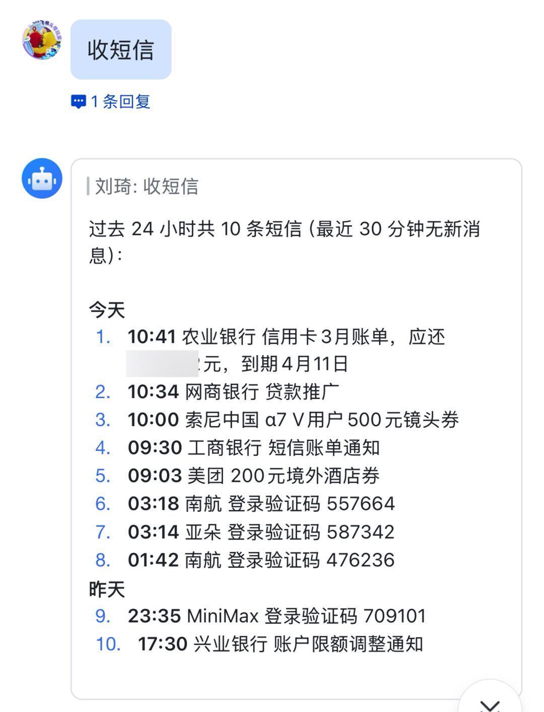
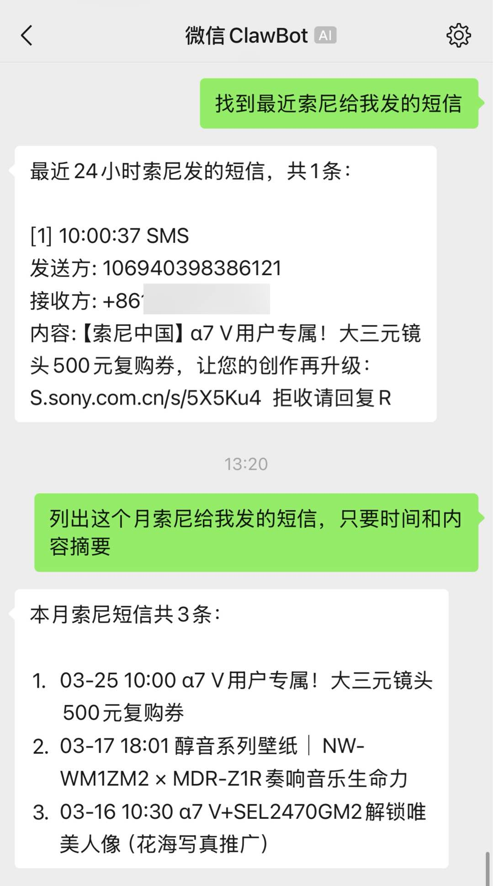
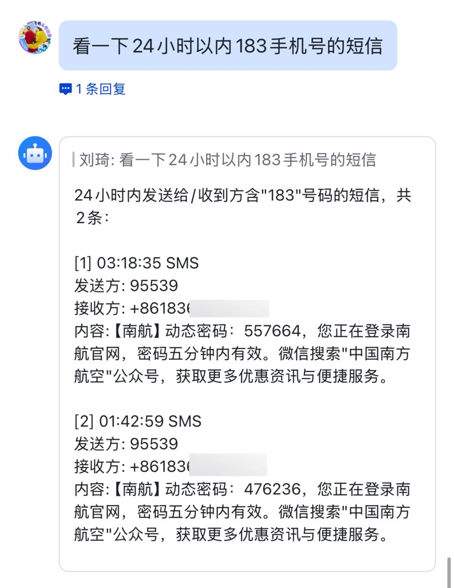
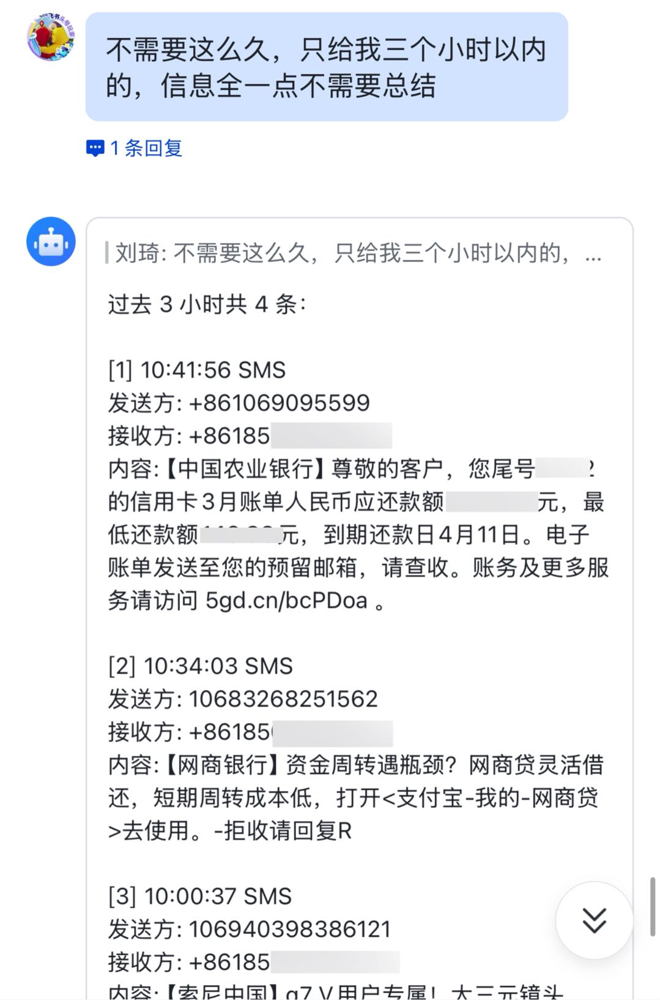

# iMessage Reader for OpenClaw

一个 [OpenClaw](https://github.com/nicepkg/openclaw) 技能，让你在任意设备上通过飞书、微信等聊天工具，用自然语言查询 Mac 上的 iMessage / SMS / RCS 消息。

## 解决什么问题

Mac 虽然能同步 iPhone 短信，但你不一定坐在 Mac 前面。你的主力工作设备可能是 Windows 或 Linux，手机可能在另一个房间充电，或者你正在开会不方便看手机。

这个技能把你常开的 Mac 变成一个短信网关：只要 Mac 能收到短信，你就能通过**任何设备上的任何聊天工具**查到它。

更重要的是，它不只是"把短信搬过来"。你可以用自然语言精确筛选：

- **按发送方查** — "95588 发来的短信"，只看工行的
- **按接收号码查** — "发给 138xxxx 的短信"，多张 SIM 卡的消息互不干扰
- **按内容查** — "ChatGPT 验证码"，从几十条短信里直接找到你要的那一条
- **按时间查** — "最近 1 小时的短信"、"今天所有消息"
- **按类型查** — 只看 SMS、只看 iMessage、或全部

不用掏手机、不用解锁、不用在几十条垃圾短信里翻找。

**典型场景：**

- 你在 Windows 电脑上工作，登录某个网站需要手机验证码 → 在飞书里跟 OpenClaw 说一句"验证码"，几秒后验证码就出现在对话里
- 手机在另一个房间充电 → 不用起身，发条消息就能看到
- 开会时手机静音放在包里 → 发个消息就能查到刚收到的短信
- 你有多张 SIM 卡，验证码散落在不同号码上 → Mac 同步了所有号码的短信，按号码过滤一步到位

### 效果展示

在飞书里说一句"收短信"，直接拿到过去 24 小时的所有短信摘要：



支持多渠道、多维度筛选——按发送方、按接收号码、按时间范围：

<p>



</p>

> 左：微信渠道，按发送方（索尼）过滤并生成摘要 / 中：飞书渠道，按接收号码（183 开头）过滤 / 右：飞书渠道，指定时间范围查完整信息

## 安全风险提示

**本技能会读取 Mac 上的短信内容，包括验证码、银行通知等敏感信息。** 请在使用前了解以下风险：

- 任何能向你的 OpenClaw 发消息的人，都可能触发短信读取（取决于你的 OpenClaw 渠道和审批配置）
- 短信内容会经过 OpenClaw 的 LLM 处理后返回，请确保你信任所使用的模型服务商
- 建议配合 OpenClaw 的 exec 审批功能使用，对敏感操作进行人工确认

请根据自身安全需求评估是否适合部署。

## 运行条件

**本技能必须部署在 macOS 上。** OpenClaw 需要运行在一台常开的 Mac（Mac Mini、iMac 等）上，这台 Mac 同时也是接收 iPhone 短信的设备。你通过其他设备（Windows 电脑、手机等）上的飞书、微信等渠道与 OpenClaw 交互来查询短信。

## 前提：让 Mac 能收到 iPhone 短信

这个技能读取的是 Mac 本机 Messages 数据库中已有的消息。你需要先确保 iPhone 的短信能同步到 Mac——只要 Mac 的"信息" app 里能看到这条短信，本技能就能读到。

### 苹果的消息同步机制

| 消息类型 | 同步方式 | 要求 |
|---------|---------|------|
| **iMessage** | 登录同一 Apple Account 并启用 iMessage 后，可在各设备间收发 | 是否同步完整历史记录，取决于是否启用了"iCloud 云端信息" |
| **SMS / MMS / RCS** | 需要额外配置"iCloud 云端信息"或"短信转发" | 见下方设置步骤 |

**关于网络要求：** 通常不要求 iPhone 和 Mac 长期处于同一 Wi-Fi。但两端需登录同一 Apple Account 并启用 iMessage；在初次设置或异常排查时，Apple 可能要求设备开启 Wi-Fi 并在彼此附近。

### 方式一：iCloud 云端信息（推荐）

开启后所有消息（iMessage + SMS + MMS + RCS）在各设备间同步，含完整历史记录。会占用 iCloud 存储空间。启用后无需单独配置"短信转发"，该功能已内含。

**iPhone：** 设置 → 你的名字（顶部）→ iCloud → 信息 → 打开"在此 iPhone 上使用"

**Mac：** 信息 app → 信息 → 设置 → iMessage → 勾选"启用 iCloud 云端信息"

### 方式二：短信转发

仅转发新收到的 SMS/MMS/RCS 到 Mac，不同步历史记录，不占 iCloud 空间。

**iPhone：** 设置 → App → 信息 → 短信转发 → 打开你的 Mac

如果看不到"短信转发"选项，先确认 iPhone 和 Mac 登录的是同一 Apple Account，且两端都已启用 iMessage。

### 验证同步是否生效

让别人给你发一条短信（或用另一台手机给自己发），看 Mac 上的"信息" app 是否收到。如果收到了，就可以继续安装。

> 详细说明参见 Apple 官方文档：[Forward text messages from your iPhone to other devices](https://support.apple.com/HT208386)

## 安装

### 环境要求

- macOS（已在 macOS Sequoia 15 和 macOS Tahoe 26 上验证）
- Xcode Command Line Tools（`xcode-select --install`）
- Python 3（macOS 自带）
- [OpenClaw](https://github.com/nicepkg/openclaw) 已安装且正常运行

### 快速安装（让 OpenClaw 自己装）

1. 克隆本仓库：

```bash
git clone https://github.com/Liu-Bot24/openclaw-imessage-reader-skill.git ~/Desktop/openclaw-imessage-reader-skill
```

2. 把 `安装指南.md` 的内容发给 OpenClaw，让它按步骤执行。它会自动完成编译、文件复制和验证。

3. 你只需手动做一件事：**授予 FDA 权限**（OpenClaw 会在合适的时候提示你）。

### 手动安装

如果你不用 OpenClaw 或想手动操作，按 `安装指南.md` 中的步骤逐步执行即可。核心流程：

```bash
# 1. 克隆
git clone https://github.com/Liu-Bot24/openclaw-imessage-reader-skill.git
cd openclaw-imessage-reader-skill

# 2. 编译
swiftc -O -o imessage-db-reader imessage-db-reader.swift
codesign -s - -f imessage-db-reader

# 3. 部署到 OpenClaw
mkdir -p ~/.openclaw/workspace/scripts
mkdir -p ~/.openclaw/workspace/skills/imessage-reader
cp imessage-db-reader imessage-db-reader.swift imessage_reader.py ~/.openclaw/workspace/scripts/
cp SKILL.md ~/.openclaw/workspace/skills/imessage-reader/
chmod 755 ~/.openclaw/workspace/scripts/imessage-db-reader
chmod 755 ~/.openclaw/workspace/scripts/imessage_reader.py

# 4. 授予 FDA（手动）
# 系统设置 → 隐私与安全性 → 完全磁盘访问权限 → 添加：
# ~/.openclaw/workspace/scripts/imessage-db-reader
```

## 使用方法

安装完成后，通过任意已接入 OpenClaw 的渠道（飞书、微信等）发送自然语言即可。OpenClaw 的 LLM 会理解你的意图并自动组合查询参数。

### 常用指令

| 你说的话 | 效果 |
|---------|------|
| 收短信 | 最近 30 分钟的所有 SMS |
| 收消息 | 最近 30 分钟的所有消息（含 iMessage） |
| 验证码是多少 | 最近 30 分钟含"验证码"等关键词的短信 |
| ChatGPT 验证码 | 含 ChatGPT / OpenAI 关键词的短信 |
| 95588 发来的短信 | 来自工商银行的短信 |
| 发给 138xxxx 的短信 | 发送到指定号码的短信 |
| 最近 1 小时的短信 | 最近 60 分钟的 SMS |
| 今天所有消息 | 最近 24 小时全部消息 |
| 最近 10 条消息 | 限制返回条数 |

### 查询参数

| 参数 | 默认值 | 说明 |
|------|--------|------|
| 时间范围 | 最近 30 分钟 | 可指定任意分钟数，无上限，可回查数据库中所有历史消息 |
| 消息类型 | 全部 | 可限定为 SMS、iMessage 或 RCS |
| 发送方 | 不限 | 支持正则匹配发送方号码或地址 |
| 接收方 | 不限 | 支持正则匹配接收方号码，适合多 SIM 卡用户按号码筛选 |
| 内容关键词 | 不限 | 支持正则匹配消息内容 |
| 返回条数 | 最多 50 条 | 可调整 |

### 返回内容

每条消息包含五个字段：

```
[1] 2026-03-25 10:41:56  SMS
    发送方: +861069095599
    接收方: +8613800001234
    内容: 【中国农业银行】您的验证码是 847291，5分钟内有效。
```

## 安全架构

```
用户请求 → OpenClaw (node, 无 FDA)
         → imessage_reader.py (python, 无 FDA, 不接触 chat.db)
         → launchctl submit
         → imessage-db-reader (Swift binary, 有 FDA)
              ↓
         拷贝 chat.db + WAL 到 /tmp → 在副本上查询 → 返回 JSON → 删除副本
         → Python 格式化 → 返回用户
```

### 为什么只给一个二进制文件授权

macOS 的"完全磁盘访问权限"（FDA）是一个很重的权限——拥有它的进程可以读取邮件、短信、Safari 历史等所有受保护的用户数据。

如果把 FDA 授给 Terminal、node 或 python，那么这些进程运行的**所有脚本和命令**都将拥有同等权限，攻击面非常大。

本技能的做法是只授权一个功能单一的编译后二进制（`imessage-db-reader`）。这个二进制：

- 无外部依赖，不联网，不写磁盘
- 只做一件事：读取 Messages 数据库并输出 JSON
- 源码随项目一起发布，可随时审计

OpenClaw 的 node 进程、Python 脚本、Terminal 都不需要也不应该拥有 FDA。

### 其他设计原则

- **只读操作**：不写入原数据库，查询在临时副本上完成，查完即删
- **进程隔离**：通过 `launchctl submit` 让 `launchd` 成为 TCC 的 responsible process，避免 node / python / Terminal 需要 FDA

## 技术细节

### macOS TCC 与 responsible process

macOS 的 TCC（Transparency, Consent, and Control）机制保护 `~/Library/Messages/chat.db`。TCC 不仅检查直接访问文件的进程，还会追溯启动链顶端的"responsible process"。从终端运行时 Terminal.app 是 responsible process，它没有 FDA，所以会被拒绝。通过 `launchctl submit` 运行时，`launchd`（PID 1）是 responsible process，不受此限制。

### 为什么要拷贝数据库

Messages.app 持有 `chat.db` 的写锁。直接只读打开可能遇到 `database is locked`。拷贝到临时目录后以读写模式打开，SQLite 会自动完成 WAL 恢复，把 WAL 日志中的新数据合并进来，避免锁冲突。

### attributedBody

macOS 较新版本中，短信内容不再存储在 `message.text` 列，而是存储在 `message.attributedBody` 列——一个 typedstream 格式的二进制 blob（`NSAttributedString` 的归档形式）。本工具使用 `NSUnarchiver` 解析 typedstream 并提取纯文本。

## 文件说明

| 文件 | 说明 |
|------|------|
| `imessage-db-reader.swift` | Swift 源码，核心读取逻辑 |
| `imessage_reader.py` | Python 包装脚本，处理 launchctl 调用和输出格式化 |
| `SKILL.md` | OpenClaw 技能定义，指导 LLM 何时/如何调用此技能 |
| `安装指南.md` | 给 AI 助手的安装步骤文档（也可人工参照） |

## 故障排查

| 问题 | 解决 |
|------|------|
| `Full Disk Access required` | 在系统设置中给 `imessage-db-reader` 添加 FDA |
| 终端直接运行报权限错 | 正常现象，通过 Python 脚本或 OpenClaw 调用即可 |
| 输出为空 | 加大 `--minutes` 值；确认 Mac 的"信息" app 中能看到短信 |
| `database is locked` | 暂时性问题，重试即可 |
| OpenClaw 不执行 | 检查技能加载、exec 审批、渠道工具策略，详见安装指南第 7.4 节 |

## 不在东八区？

修改 `imessage-db-reader.swift` 中的时区设置：

```swift
fmt.timeZone = TimeZone(identifier: "America/New_York") // 改成你的时区
```

然后重新编译、签名、授权 FDA。

## License

MIT
